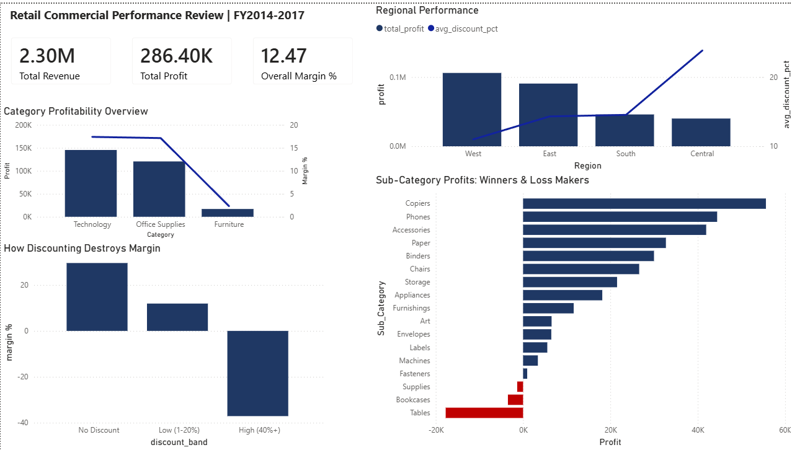

# Retail Commercial Performance Review | FY2014–2017

## Project Summary
End-to-end commercial analysis of a retail business across four years, 
identifying category and regional profitability drivers, quantifying the 
impact of discounting on margin, and delivering actionable recommendations 
for a commercial leadership team.

This project replicates the core workflow of a commercial/insights analyst 
role: data extraction and transformation in SQL, analysis in Power BI, 
and findings communicated via an executive decision memo.

---

## Business Questions Answered
- Which categories and sub-categories are driving or destroying margin?
- What is the financial impact of discounting on overall profitability?
- Which regions are underperforming and why?
- What are the top commercial recommendations?

---

## Key Findings
- **Furniture delivers only 2.32% margin** despite generating $733K revenue,
  comparable to Office Supplies which delivers 17.13% on similar revenue
- **High discounting (40%+) is generating a $134K loss** across 1,344 orders
  at -37.12% margin — while undiscounted orders deliver 29.57% margin
- **Central region is underperforming** at 8.06% margin due to 23.85% average
  discounting — more than double the West region's 11% discount rate

---

## Recommendations
1. Implement a 20% discount ceiling across all categories
2. Review Furniture Tables and Bookcases pricing and promotional strategy
3. Audit and reset Central region discount practices to align with West

**Estimated impact: $100K–$150K incremental profit on current revenue**

---

## Tools Used
- **MySQL** — data cleaning, transformation, and analysis queries
- **Power BI** — interactive dashboard with KPI cards, category, 
  sub-category, discount impact, and regional performance visuals
- **Excel/PDF** — executive decision memo

---

## Files in This Repository
| File | Description |
|---|---|
| `superstore_clean.csv` | Cleaned dataset (9,694 rows after encoding cleanup) |
| `query1_category.csv` | Category-level profitability analysis |
| `query2_subcategory.csv` | Sub-category profitability ranked by profit |
| `query3_discount.csv` | Discount band impact on margin |
| `query4_regional.csv` | Regional performance vs discount rate |
| `Commercial_Performance_Decision_Memo.pdf` | One-page executive recommendation |
| `dashboard_screenshot.png` | Power BI dashboard |

---

## Dashboard Preview

---

## Data Source
Sample Superstore dataset — publicly available via Kaggle.
300 rows removed during encoding cleanup due to non-ASCII characters 
in product name fields. Core sales and profitability metrics unaffected.

---

## Author
**Milind Thapar**
[LinkedIn](https://www.linkedin.com/in/milindthapar) | 
[GitHub](https://github.com/milindthapar)
